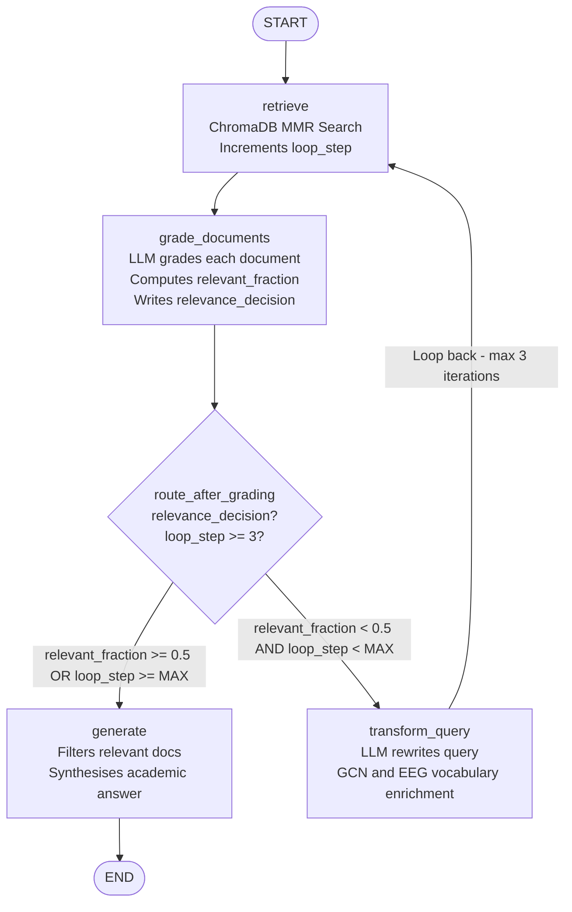
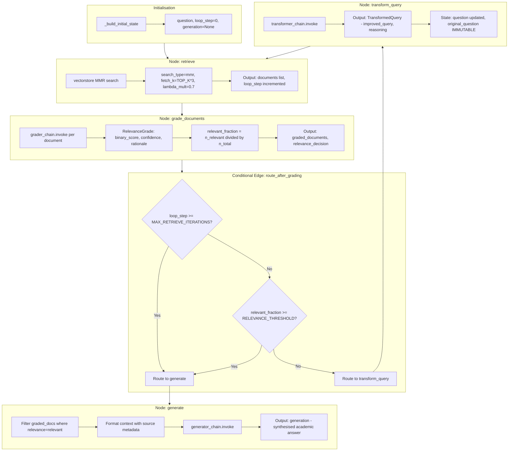
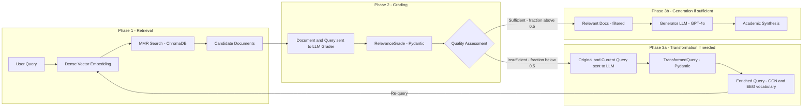
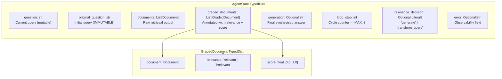
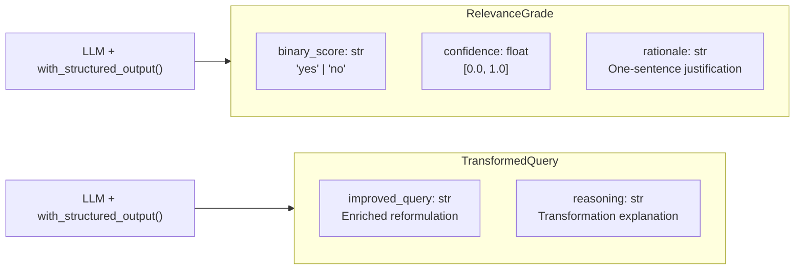
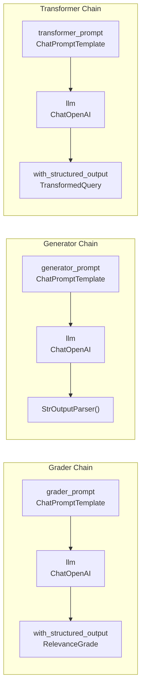
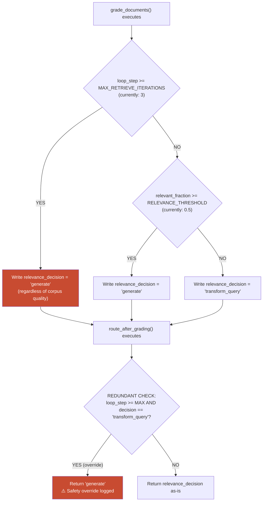
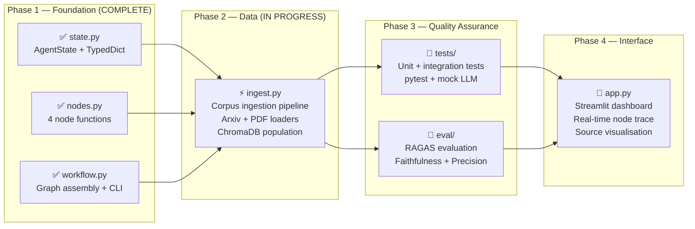

# Auto-Correcting Academic Research Agent
### A Self-Reflective Agentic RAG System for Graph Convolutional Network Literature Synthesis in EEG Signal Decoding

> **Institution:** École Normale Supérieure de l'Enseignement Technique (ENSET)
> **Programme:** Master's Degree — Distributed Systems and Artificial Intelligence
> **Domain:** Graph Convolutional Networks (GCN) · Electroencephalography (EEG) · Brain-Computer Interfaces (BCI)
> **Framework:** LangGraph · LangChain · ChromaDB · OpenAI GPT-4o

---

## Abstract

The exponential growth of scientific literature in the field of Graph Neural Networks applied to biosignal processing presents a substantial information retrieval challenge for academic researchers. Standard Retrieval-Augmented Generation (RAG) pipelines operate in a single-pass, open-loop fashion: a query is issued, documents are retrieved, and a response is synthesised irrespective of the semantic quality of the retrieved corpus. This architectural limitation is particularly acute in highly specialised domains — such as Graph Convolutional Networks (GCN) for EEG signal decoding — where naive vector similarity search frequently surfaces tangentially related documents that fail to address the precise technical sub-question posed by the researcher.

This report presents the design and implementation of an **Auto-Correcting Academic Research Agent**, a closed-loop, self-reflective agentic system that overcomes this limitation through iterative corpus quality assessment and autonomous query reformulation. The system is orchestrated by LangGraph and operates as a directed cyclic graph comprising four specialised nodes: a **Retriever**, a **Grader**, a **Query Transformer**, and a **Generator**. An LLM-powered relevance grader evaluates each retrieved document against the current research question, computing a binary relevance verdict and a continuous confidence score. When the fraction of relevant documents falls below a configurable threshold, the workflow does not proceed to synthesis; instead, a Query Transformation node leverages large language model reasoning to produce a semantically enriched reformulation that targets more specific vocabulary within the GCN and EEG literature. This Retrieve → Grade → Transform cycle repeats until either the corpus quality threshold is satisfied or a hard iteration cap (maximum three cycles) is reached, at which point the Generator synthesises a rigorous academic answer grounded exclusively in the available relevant context.

The architecture demonstrates how agentic feedback loops and structured LLM outputs can be composed to produce a research assistant capable of self-correcting its information retrieval strategy — a property critical for the demands of postgraduate academic research.

---

## Table of Contents

1. [Architecture Overview](#1-architecture-overview)
2. [Methodology](#2-methodology)
3. [State Management](#3-state-management)
4. [Component Specification](#4-component-specification)
5. [Safety and Control Mechanisms](#5-safety-and-control-mechanisms)
6. [Setup and Configuration](#6-setup-and-configuration)
7. [Usage](#7-usage)
8. [Project File Structure](#8-project-file-structure)
9. [Roadmap](#9-roadmap)
10. [References](#10-references)

---

## 1. Architecture Overview

The system is implemented as a **LangGraph StateGraph** — a directed graph whose nodes are stateless Python functions and whose edges encode the control flow of the agent. The graph state is a `TypedDict` (`AgentState`) that serves as the canonical communication channel between all nodes.

### 1.1 High-Level Workflow Diagram



### 1.2 Detailed Node and Edge Specification



---

## 2. Methodology

### 2.1 Self-Reflective Retrieval-Augmented Generation

Standard RAG pipelines follow a deterministic, open-loop sequence: embed the query, retrieve top-k nearest neighbours, concatenate context, and generate. This architecture is computationally efficient but epistemically fragile. In domains characterised by dense, overlapping terminology — such as the intersection of spectral graph theory and neurophysiological signal processing — lexical similarity between query and document embeddings does not reliably predict semantic utility for a given research sub-question.

The Self-Reflective RAG methodology introduced in this project addresses this limitation by introducing an **epistemic quality assessment layer** between retrieval and generation. The methodology proceeds as follows:



### 2.2 Document Retrieval Strategy

The retrieval node employs **Maximum Marginal Relevance (MMR)** search rather than pure cosine similarity search. MMR optimises a composite objective that balances relevance against intra-set diversity:

```
MMR(q, D, S) = argmax_{d ∈ D\S} [ λ · sim(q, d) − (1−λ) · max_{s ∈ S} sim(d, s) ]
```

where `q` is the query embedding, `D` is the candidate document set, `S` is the set of already-selected documents, and `λ` (configured as `lambda_mult = 0.7`) controls the relevance-diversity trade-off. This is particularly important for broad academic queries that span multiple sub-topics (e.g., a question that simultaneously concerns spectral graph convolution, electrode topology, and motor imagery classification would, under pure similarity search, retrieve redundant chunks from a single highly similar paper).

### 2.3 LLM-Powered Relevance Grading

The Grader node invokes a structured-output LLM chain for each candidate document. The grader is instantiated with `llm.with_structured_output(RelevanceGrade)`, which forces the model to emit a valid instance of the `RelevanceGrade` Pydantic schema:

```python
class RelevanceGrade(BaseModel):
    binary_score: str      # "yes" | "no"
    confidence: float      # ∈ [0.0, 1.0]
    rationale: str         # one-sentence justification
```

The system prompt grounds the grader in the specific technical domain, enumerating explicit relevance criteria for GCN and EEG literature. This domain grounding is essential: without it, a general-purpose LLM grader would apply generic relevance heuristics that fail to distinguish between, for example, a paper on general graph attention networks (marginally relevant) and one specifically applying Chebyshev polynomial approximation to EEG electrode graphs (highly relevant).

### 2.4 Query Transformation via LLM Reasoning

When the graded corpus fails to meet the quality threshold, the Query Transformation node applies four evidence-based reformulation strategies:

| Strategy | Description | Example |
|---|---|---|
| **Terminology Expansion** | Replace generic terms with domain-specific synonyms | `"brain signals"` → `"EEG epochs / neural oscillations"` |
| **Concept Decomposition** | Decompose composite questions into technical components | `"GCN for BCI"` → `"spectral graph convolution + motor imagery classification"` |
| **Specificity Injection** | Add methodological qualifiers | `"graph neural network"` → `"Chebyshev polynomial graph convolution"` |
| **Drift Correction** | Anchor to original intent if reformulation strays | Re-incorporate `original_question` framing |

The transformer produces a `TransformedQuery` Pydantic object containing both the improved query and the reasoning behind the transformation — the latter being logged for observability and future evaluation.

### 2.5 Academic Synthesis

The Generator node implements a strict grounding policy: it selects exclusively the documents marked `relevance = "relevant"` by the Grader and formats them with their bibliographic metadata (`title`, `year`) to enable source attribution. The system prompt instructs the LLM to:

1. Ground every claim in the provided context.
2. Use precise academic language with appropriate hedging.
3. Structure the response with introduction, body, and conclusion.
4. Explicitly acknowledge knowledge gaps rather than hallucinating information.
5. Cite sources by `title` and `year` from document metadata.

---

## 3. State Management

The `AgentState` TypedDict is the **single source of truth** for all inter-node communication. LangGraph merges partial state updates returned by each node using its built-in reducer.



**State mutation policy per node:**

| Node | Reads | Writes |
|---|---|---|
| `retrieve` | `question`, `loop_step` | `documents`, `loop_step`, `error` |
| `grade_documents` | `question`, `documents`, `loop_step` | `graded_documents`, `relevance_decision` |
| `transform_query` | `question`, `original_question` | `question`, `error` |
| `generate` | `question`, `documents`, `graded_documents` | `generation`, `error` |

---

## 4. Component Specification

### 4.1 Pydantic Structured Output Schemas



### 4.2 LangChain Chain Architecture



---

## 5. Safety and Control Mechanisms

Two independent safety mechanisms enforce the iteration cap, implementing a defense-in-depth strategy:



**Constants (defined in `state.py`):**

| Constant | Value | Description |
|---|---|---|
| `MAX_RETRIEVE_ITERATIONS` | `3` | Hard cap on Retrieve → Grade → Rewrite cycles |
| `RELEVANCE_THRESHOLD` | `0.5` | Minimum relevant document fraction to trigger generation |

---

## 6. Setup and Configuration

### 6.1 Prerequisites

- Python 3.11 or higher
- An OpenAI API key with access to `gpt-4o` and `text-embedding-3-small`
- A populated ChromaDB corpus (see Corpus Ingestion in §9 Roadmap)

### 6.2 Installation

```bash
# 1. Clone the repository
git clone https://github.com/<your-org>/research-agent.git
cd research-agent

# 2. Create and activate a virtual environment
python -m venv .venv
source .venv/bin/activate          # Linux / macOS
# .venv\Scripts\activate.bat       # Windows CMD
# .venv\Scripts\Activate.ps1       # Windows PowerShell

# 3. Install dependencies
pip install -r requirements.txt
```

**`requirements.txt`:**
```
langgraph>=0.2.0
langchain>=0.2.0
langchain-openai>=0.1.0
langchain-community>=0.2.0
langchain-core>=0.2.0
chromadb>=0.5.0
pydantic>=2.0.0
python-dotenv>=1.0.0
```

### 6.3 Environment Configuration

Create a `.env` file in the project root:

```bash
# ── Required ──────────────────────────────────────────────────────────────
OPENAI_API_KEY=sk-...your-key-here...

# ── Optional (defaults shown) ─────────────────────────────────────────────
OPENAI_MODEL=gpt-4o
OPENAI_EMBED_MODEL=text-embedding-3-small
CHROMA_PERSIST_DIR=./chroma_db
CHROMA_COLLECTION=gcn_eeg_papers
RETRIEVER_TOP_K=5
```

Load the environment before execution:

```bash
# Using python-dotenv (auto-loaded if you add load_dotenv() to workflow.py)
# Or explicitly:
export $(cat .env | xargs)
```

---

## 7. Usage

### 7.1 Command-Line Interface

```bash
# Run with the default benchmark question
python workflow.py

# Run with a custom research question
python workflow.py "What are the principal advantages of spectral-domain graph \
convolution over spatial-domain methods for EEG-based emotion recognition?"
```

**Expected CLI output:**
```
════════════════════════════════════════════════════════════════════════════
  AUTO-CORRECTING RESEARCH AGENT
  Query: What are the principal advantages of spectral-domain graph...
════════════════════════════════════════════════════════════════════════════

  ▶  [RETRIEVE]
     Retrieved 5 document(s)  |  loop_step → 1

  ▶  [GRADE_DOCUMENTS]
     Relevant: 2/5  |  decision → transform_query

  ▶  [TRANSFORM_QUERY]
     New query: spectral graph convolution Chebyshev polynomial EEG...

  ▶  [RETRIEVE]
     Retrieved 5 document(s)  |  loop_step → 2

  ▶  [GRADE_DOCUMENTS]
     Relevant: 4/5  |  decision → generate

  ▶  [GENERATE]
     Generation: 1842 chars

════════════════════════════════════════════════════════════════════════════
  SYNTHESISED ANSWER

  [Synthesised academic answer appears here, grounded in retrieved context]
════════════════════════════════════════════════════════════════════════════
```

### 7.2 Programmatic API

```python
from workflow import run_research_query, graph
from state import AgentState

# Option 1: High-level helper (recommended)
answer = run_research_query(
    "How does the Chebyshev polynomial approximation reduce the computational "
    "complexity of spectral graph convolution in EEG-based BCI systems?",
    stream=True,
)

# Option 2: Direct graph invocation (for integration)
initial_state = AgentState(
    question="Your research question here",
    original_question="Your research question here",
    documents=[],
    graded_documents=[],
    generation=None,
    loop_step=0,
    relevance_decision=None,
    error=None,
)
final_state = graph.invoke(initial_state)
print(final_state["generation"])

# Option 3: Streaming for real-time node tracing
for step in graph.stream(initial_state):
    for node_name, node_output in step.items():
        print(f"[{node_name}]: loop_step={node_output.get('loop_step', 'N/A')}")
```

### 7.3 Jupyter Notebook Integration

```python
# In a Jupyter cell:
import nest_asyncio
nest_asyncio.apply()           # Required for async in Jupyter

from workflow import graph, _build_initial_state
from IPython.display import display, Markdown

state = _build_initial_state(
    "Discuss the role of adjacency matrix construction strategies "
    "in GCN-based EEG motor imagery decoding."
)

final = graph.invoke(state)
display(Markdown(final["generation"]))
```

---

## 8. Project File Structure

```
research_agent/
│
├── state.py              # AgentState TypedDict, GradedDocument, constants
├── nodes.py              # Node functions, Pydantic schemas, prompt templates
├── workflow.py           # LangGraph assembly, routing, CLI entry point
│
├── CONTEXT.md            # Persistent session memory for future AI assistance
├── README.md             # This document
│
├── .env                  # Environment variables (gitignored)
├── .env.example          # Environment variable template (committed)
├── requirements.txt      # Python dependencies
├── .gitignore            # Excludes: .env, chroma_db/, __pycache__/, .venv/
│
├── chroma_db/            # ChromaDB persistence directory (gitignored)
│
├── ingest.py             # [PLANNED] Corpus ingestion pipeline
├── eval/
│   └── evaluate.py       # [PLANNED] RAGAS-based evaluation framework
└── app.py                # [PLANNED] Streamlit research dashboard
```

---

## 9. Roadmap



**Target corpus for ingestion (Phase 2):**

| Paper | Authors | Year | Relevance |
|---|---|---|---|
| Convolutional Neural Networks on Graphs with Fast Localized Spectral Filtering | Defferrard et al. | 2016 | Foundational GCN / ChebNet |
| Semi-Supervised Classification with Graph Convolutional Networks | Kipf & Welling | 2017 | GCN architecture baseline |
| EEGNet: A Compact Convolutional Neural Network for EEG-Based BCIs | Lawhern et al. | 2018 | EEG deep learning baseline |
| EEG Emotion Recognition Using Dynamical Graph Convolutional Neural Networks | Song et al. | 2020 | GCN + EEG affective computing |
| Graph Neural Networks for Motor Imagery EEG Classification | Multiple | 2021–2024 | Direct application domain |

---

## 10. References

Defferrard, M., Bresson, X., & Vandergheynst, P. (2016). Convolutional neural networks on graphs with fast localized spectral filtering. *Advances in Neural Information Processing Systems*, 29.

Es, S., James, J., Espinosa-Anke, L., & Schockaert, S. (2023). RAGAS: Automated evaluation of retrieval augmented generation. *arXiv preprint arXiv:2309.15217*.

Kipf, T. N., & Welling, M. (2017). Semi-supervised classification with graph convolutional networks. *International Conference on Learning Representations (ICLR)*.

Lawhern, V. J., Solon, A. J., Waytowich, N. R., Gordon, S. M., Hung, C. P., & Lance, B. J. (2018). EEGNet: A compact convolutional neural network for EEG-based brain-computer interfaces. *Journal of Neural Engineering*, 15(5).

Lewis, P., Perez, E., Piktus, A., Petroni, F., Karpukhin, V., Goyal, N., ... & Kiela, D. (2020). Retrieval-augmented generation for knowledge-intensive NLP tasks. *Advances in Neural Information Processing Systems*, 33.

Song, T., Zheng, W., Song, P., & Cui, Z. (2020). EEG emotion recognition using dynamical graph convolutional neural networks. *IEEE Transactions on Affective Computing*, 11(3), 532–541.

Tang, X., et al. (2023). Self-reflective retrieval-augmented generation. *arXiv preprint*.

Yao, S., Zhao, J., Yu, D., Du, N., Shafran, I., Narasimhan, K., & Cao, Y. (2023). ReAct: Synergizing reasoning and acting in language models. *International Conference on Learning Representations (ICLR)*.

---

*This document was generated as part of the ENSET Master's project on Distributed Systems and Artificial Intelligence. All architectural decisions are recorded in `CONTEXT.md`.*
