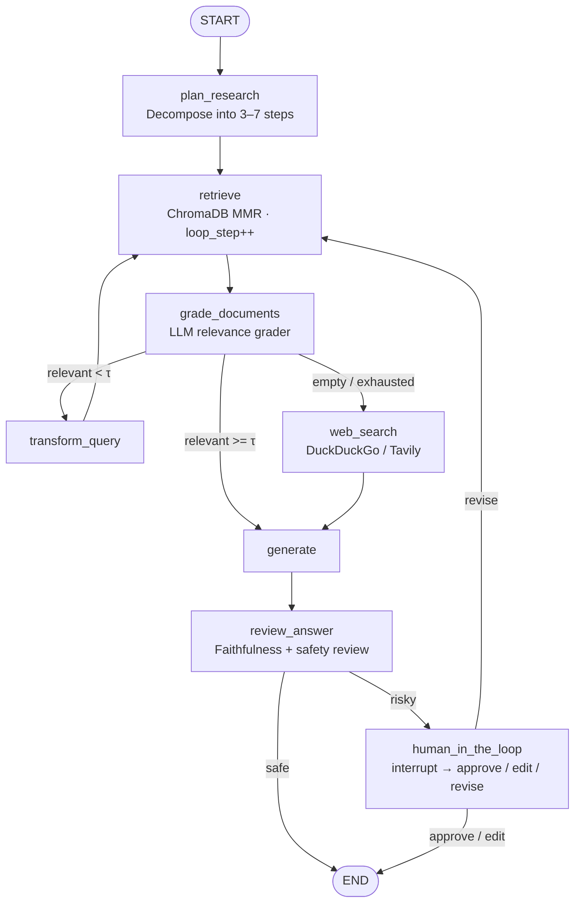

# Auto-Correcting Academic Research Agent
### A Self-Reflective Agentic RAG System with Multi-Provider LLM, Web-Search Augmentation, Human-in-the-Loop, and an Angular MVVM Workspace

> **Institution:** École Normale Supérieure de l'Enseignement Technique (ENSET)
> **Programme:** Master's Degree — Distributed Systems and Artificial Intelligence
> **Domain:** Graph Convolutional Networks (GCN) · Electroencephalography (EEG) · Brain-Computer Interfaces (BCI)
> **Stack:** LangGraph · LangChain · ChromaDB · FastAPI · uv · Angular 21 · Tailwind v4

---

## Abstract

The exponential growth of scientific literature in Graph Neural Networks applied to biosignal processing presents a substantial information-retrieval challenge for academic researchers. Standard Retrieval-Augmented Generation (RAG) pipelines operate in a single-pass open-loop fashion: a query is issued, documents are retrieved, and a response is synthesised irrespective of the semantic quality of the retrieved corpus. This architectural limitation is particularly acute in highly specialised domains — such as Graph Convolutional Networks (GCN) for EEG signal decoding — where naive vector similarity search frequently surfaces tangentially related documents that fail to address the precise technical sub-question posed by the researcher.

This report presents the **Auto-Correcting Academic Research Agent**, a closed-loop, self-reflective agentic system that overcomes this limitation through iterative corpus quality assessment, autonomous query reformulation, **live web-search augmentation** when the local corpus is exhausted, and a **human-in-the-loop safety gate** before any potentially risky answer is committed. The orchestration is implemented in LangGraph as a directed cyclic graph; the system is exposed as a FastAPI service with a typed REST surface and Server-Sent Events streaming, and is consumed by an Angular MVVM workspace that visualises every node of the graph in real time. A pluggable LLM factory selects between **Google Gemini**, **OpenAI**, or **xAI Grok** at startup based on which API key is present in `.env`, so the same codebase ships with three interchangeable cognitive backends.

---

## Table of Contents

1. [System Architecture](#1-system-architecture)
2. [Agent Workflow (LangGraph)](#2-agent-workflow-langgraph)
3. [Backend (FastAPI + uv)](#3-backend-fastapi--uv)
4. [Frontend (Angular MVVM)](#4-frontend-angular-mvvm)
5. [Multi-provider LLM](#5-multi-provider-llm)
6. [Tools — Vector + Web Search](#6-tools--vector--web-search)
7. [Human-in-the-loop](#7-human-in-the-loop)
8. [Prompt A/B Evaluation](#8-prompt-ab-evaluation)
9. [Setup & Running the Stack](#9-setup--running-the-stack)
10. [Project File Structure](#10-project-file-structure)
11. [API Surface](#11-api-surface)
12. [Safety & Observability](#12-safety--observability)
13. [Roadmap](#13-roadmap)

---

## 1. System Architecture

The system is composed of three independently deployable layers:

```
┌─────────────────────────────────────────────────────────────────────┐
│  Angular 21 MVVM Workspace (auto-corrector-rag-frontend)            │
│  • Workspace / Library / System-Health pages (lazy-loaded)          │
│  • Signal-based ViewModels (agent-session, library, evaluation, …) │
│  • SSE EventSource client for live agent traces                     │
└──────────────────────────────┬──────────────────────────────────────┘
                               │  REST + SSE  (proxied through /api)
┌──────────────────────────────▼──────────────────────────────────────┐
│  FastAPI Backend (backend/)                                         │
│  controllers → services → repositories → models   (layered)         │
│  • Multi-provider LLM factory (Gemini / OpenAI / Grok)              │
│  • LangGraph workflow with checkpointed sessions                    │
│  • Web search tool (DuckDuckGo / Tavily)                            │
│  • PDF ingestion pipeline                                           │
│  • A/B prompt evaluation (LLM-as-judge)                             │
└──────────────────────────────┬──────────────────────────────────────┘
                               │
┌──────────────────────────────▼──────────────────────────────────────┐
│  ChromaDB persistent vector store + ./chroma_db                     │
└─────────────────────────────────────────────────────────────────────┘
```

### 1.1 Backend layered architecture

```
backend/src/rag_agent/
├── core/             config, logging, multi-provider LLM/embedding factories
├── models/           Pydantic DTOs + LangGraph TypedDict state
├── repositories/     ChromaDB vector access + PDF document loader
├── services/         business logic
│   ├── tools/        web_search.py · vector_search.py
│   ├── prompts.py    centralised templates
│   ├── chains.py     LLM chain factories
│   ├── nodes.py      LangGraph node functions
│   ├── workflow.py   StateGraph assembly + routers
│   ├── agent_service.py
│   ├── ingestion_service.py
│   └── evaluation_service.py
└── controllers/      health · agent · ingest · evaluate routers
```

### 1.2 Frontend MVVM layers

```
auto-corrector-rag-frontend/src/app/
├── core/        ─── Model layer (DTOs, HTTP/SSE services, signal stores)
├── features/    ─── View layer (Workspace · Library · System Health pages)
└── shared/      ─── chrome (TopAppBar, SideNav, StatusFooter, Shell)
```

The boundary is enforced: a feature component reads signals from its store
and emits intent (method calls). It never imports an HTTP service directly.

---

## 2. Agent Workflow (LangGraph)



Key properties:

- **`loop_step`** is incremented only in `retrieve` (RULE S-3 in `CONTEXT.md`),
  capped by `MAX_RETRIEVE_ITERATIONS` (defense-in-depth in both the grader
  and the router).
- The decision to call `web_search` is taken when (a) the local retriever
  returned zero results, or (b) the relevance threshold is still missed at
  the final allowed retrieval iteration. This converts a dead-end loop into
  a fall-back live search.
- `review_answer` runs LLM-as-judge groundedness scoring and may set
  `needs_human_review=True`, which routes to a `human_in_the_loop` node that
  calls LangGraph's `interrupt()` API. The frontend resumes by posting a
  `Command(resume=…)` through `/api/agent/resume/{thread_id}/stream`.

---

## 3. Backend (FastAPI + uv)

Why **FastAPI** over Flask:

- Native `async` lets us stream SSE without thread-pool gymnastics.
- Automatic OpenAPI/Swagger at `/docs` (useful for the Angular team and
  for `openapi-typescript` codegen if desired).
- Pydantic v2 DTOs mirror the LangGraph state cleanly.

Why **uv** over pip:

- Single-binary, lock-file-driven resolver (`uv.lock` is committed).
- 10×+ faster cold installs in CI.
- Built-in `uv run` task runner for the `rag-api` and `rag-ingest` console
  scripts declared in `pyproject.toml`.

---

## 4. Frontend (Angular MVVM)

The frontend is a deliberate, opinionated MVVM:

| Layer | Where | Responsibility |
|---|---|---|
| **Model** | `core/models/*.ts` + `core/services/*.ts` | DTO shapes, HTTP / SSE calls — no UI awareness |
| **ViewModel** | `core/state/*.store.ts` | Signal-based reactive state, derived `computed()` signals, action methods. One store per feature. |
| **View** | `features/**/{page,components}` | Standalone components that render the ViewModel's signals; no direct API access |

This separation lets the workspace `WorkspacePage` consume the same
`AgentSessionStore` that drives the live trace and the HITL banner, with no
parent/child glue code. The store is the single source of truth for the run.

The UI faithfully implements the supplied cyber-brutalist design system —
sharp corners, hairline `border-outline-variant` dividers, the Source Serif
4 body and Archivo Narrow technical labels, the scanline overlay on the
right pane, and the `bg-surface-container-lowest` workspace canvas.

---

## 5. Multi-provider LLM

Set **one** of these in `backend/.env`:

```bash
GEMINI_API_KEY=...        # → Gemini 1.5 Pro    + Gemini embeddings
OPENAI_API_KEY=...        # → GPT-4o            + text-embedding-3-small
GROK_API_KEY=...          # → Grok 2            + local HF embeddings
```

The factory in [`backend/src/rag_agent/core/llm_factory.py`](backend/src/rag_agent/core/llm_factory.py)
resolves the provider deterministically:

1. Explicit `LLM_PROVIDER=<name>` override (must match a present key).
2. Otherwise the first non-empty key in the order **Gemini → OpenAI → Grok**.

Embeddings track the provider, with one important fallback: Grok exposes no
embedding API, so it transparently falls back to a local
`sentence-transformers/all-MiniLM-L6-v2` model so ingestion and retrieval
keep working.

---

## 6. Tools — Vector + Web Search

The agent does **not** rely on the local corpus alone. Two tools are wired:

- `services/tools/vector_search.py` — thin facade over `VectorRepository`,
  used by the `retrieve` node.
- `services/tools/web_search.py` — DuckDuckGo by default (no key needed),
  Tavily if `TAVILY_API_KEY` is set. Hits are wrapped as LangChain
  `Document` objects with `origin: "web"` and merged into the graded pool so
  the generator and the citation renderer treat them uniformly.

A document's origin is displayed as a tag on every citation in the
frontend's finding card, so the reviewer can immediately tell whether a
claim is grounded in the indexed corpus or in a live web result.

---

## 7. Human-in-the-loop

After the generator runs, a reviewer chain assesses faithfulness. If it
returns `needs_human_review=True` (or if generation failed entirely), the
graph reaches `human_in_the_loop`, which calls LangGraph's `interrupt(...)`.
The HTTP stream surfaces this as an SSE `interrupt` event carrying the
thread id and the payload. The frontend's `HitlBannerComponent` lets the
operator pick:

| Action | Effect |
|---|---|
| `approve` | Resume with the current draft as the final answer. |
| `edit_answer` | Submit a corrected answer (immediately final). |
| `revise_query` | Replace the question and re-enter the retrieval loop. |

The resume call hits `/api/agent/resume/{thread_id}/stream`, which posts a
`Command(resume=payload)` into the checkpointed graph — the same thread,
same state, picked up exactly where it paused.

---

## 8. Prompt A/B Evaluation

`POST /api/evaluate` accepts a list of questions and runs each question
through both prompt variants `A` (narrative) and `B` (structured headings).
An LLM-as-judge chain scores `answer_relevance`, `groundedness`, and an
`overall` aggregate in `[0, 1]`. The Angular `EvaluationConsoleComponent`
renders the side-by-side results with a winner badge.

---

## 9. Setup & Running the Stack

### Prerequisites
- Python 3.11+ and [uv](https://docs.astral.sh/uv/)
- Node.js 20+ and npm

### Backend

```bash
cd backend
cp .env.example .env
#   Edit .env: set GEMINI_API_KEY or OPENAI_API_KEY or GROK_API_KEY
uv sync
uv run rag-ingest ./papers      # one-off: ingest a folder of PDFs
uv run rag-api                  # http://localhost:8000 · /docs for Swagger
```

### Frontend

```bash
cd auto-corrector-rag-frontend
npm install
npm start                       # http://localhost:4200
```

The Angular dev server proxies `/api/*` to `http://localhost:8000`, so no
CORS configuration is needed during development. CORS is also pre-enabled
on the FastAPI side for `http://localhost:4200`.

---

## 10. Project File Structure

```
.
├── backend/                                FastAPI service (uv project)
│   ├── pyproject.toml
│   ├── uv.lock
│   ├── .env.example
│   ├── README.md
│   ├── ANGULAR_INTEGRATION.md
│   └── src/rag_agent/
│       ├── main.py
│       ├── core/ {config, logging, llm_factory}.py
│       ├── models/ {state, schemas, grading}.py
│       ├── repositories/ {vector_repository, document_repository}.py
│       ├── services/
│       │   ├── tools/ {vector_search, web_search}.py
│       │   ├── prompts.py · chains.py
│       │   ├── nodes.py · workflow.py
│       │   ├── agent_service.py
│       │   ├── ingestion_service.py
│       │   └── evaluation_service.py
│       └── controllers/ {health, agent, ingestion, evaluation}_controller.py
│
├── auto-corrector-rag-frontend/            Angular 21 MVVM workspace
│   ├── README.md
│   ├── proxy.conf.json                     /api → :8000
│   ├── src/styles.css                      Tailwind v4 @theme tokens
│   └── src/app/
│       ├── core/      models/ · services/ · state/
│       ├── features/  workspace/ · library/ · system-health/
│       └── shared/    layout/ (TopAppBar, SideNav, Footer, Shell)
│
├── CONTEXT.md                              Coding standards & ADR log
└── README.md                               This file
```

---

## 11. API Surface

```
GET  /api/health                              provider, model, vector store, web tool
POST /api/agent/run                           sync run, returns full final state
GET  /api/agent/stream                        SSE — live agent trace
POST /api/agent/resume/{thread_id}            resume after HITL (sync)
GET  /api/agent/resume/{thread_id}/stream     resume after HITL (SSE)
GET  /api/agent/state/{thread_id}             inspect a checkpointed session
POST /api/ingest/pdfs                         ingest a server-side directory
POST /api/ingest/upload                       multipart upload + ingest
POST /api/evaluate                            A/B prompt evaluation
```

Full schemas live in [`backend/src/rag_agent/models/schemas.py`](backend/src/rag_agent/models/schemas.py)
and are auto-rendered at `http://localhost:8000/docs`.

---

## 12. Safety & Observability

- **Hard loop cap** — `MAX_RETRIEVE_ITERATIONS = 3` (defaults via env).
- **Defense-in-depth router** — the loop cap is enforced in *both* the
  grader (writes the decision) and the conditional router (overrides).
- **Web-search escalation** — replaces "loop until cap" with "search the
  web at the cap", so dead-ends don't silently degrade answer quality.
- **Reviewer chain** before the answer can leave the graph.
- **Human-in-the-loop interrupt** for risky answers, with full state
  preservation through LangGraph's checkpointer.
- **Structured logs** at every node entry / decision point following
  `NODE:<name> | key=value | …` (RULE O-2 in `CONTEXT.md`).

---

## 13. Roadmap

- Persistent thread checkpointer (swap `MemorySaver` for SQLite / Redis).
- Per-document chunking metadata in the corpus table.
- Tavily web-search advanced filters (domain include/exclude) configurable from the UI.
- Reranking node between `retrieve` and `grade_documents`.
- Auth (Keycloak / OAuth) on the FastAPI surface.
- Hosted deployment recipe (Docker Compose for backend + Nginx for the Angular bundle).
